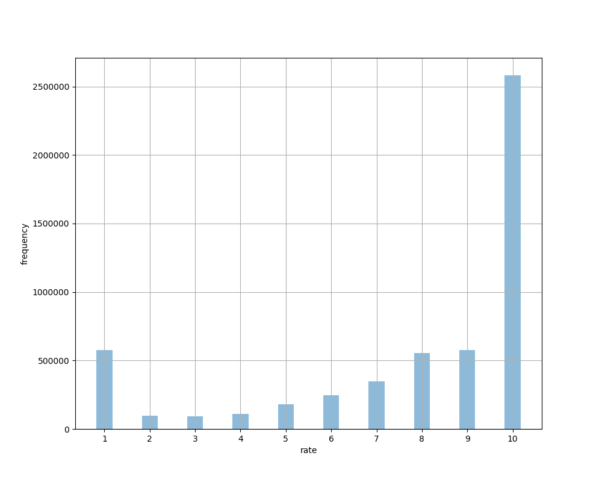
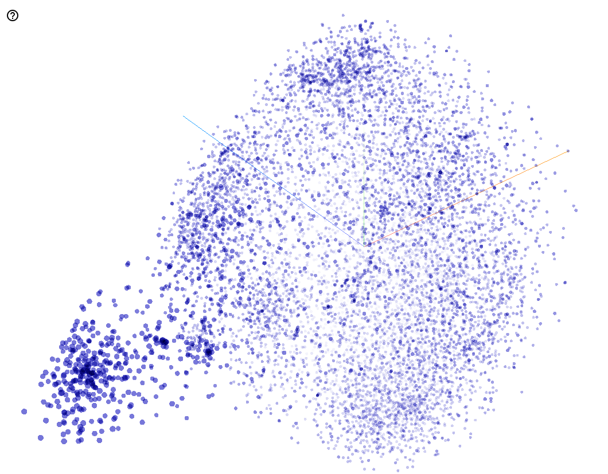

# NAVER Movie Rate Prediction
네이버 영화 평점 예측 with Tensorflow

## Environments
* OS  : Ubuntu 16.04/18.04 x86-64 ~
* CPU : any (quad core ~)
* GPU : GTX 1060 6GB ~
* RAM : 16GB ~
* Library : TF 1.x with CUDA 9.0~ + cuDNN 7.0~
* Python 3.x

## Prerequisites
* python 3.x
* java 1.7+
* tensorflow 1.x
* numpy
* gensim and konlpy and soynlp
* mecab-ko
* pymysql
* h5py
* tqdm
* PyKoSpacing
* (Optional) MultiTSNE (for visualization)
* (Optional) matplotlib (for visualization)

## DataSet

| DataSet  |  Language  | Sentences | Size |
|:---:|:---:|:---:|:---:|
| [NAVER Movie Review](http://movie.naver.com) | *Korean* | ```5.36M``` | ```About 557MB``` | 

### Movie Review Data Distribution



> data imbalance is worried... maybe rate-10 data should be downsized by 20%

## Usage
### 1.1 Installing Dependencies
    # Necessary
    $ sudo python3 -m pip install -r requirements.txt
    # Optional
    $ sudo python3 -m pip install -r opt_requirements.txt
### 1.2 Configuration
    # In ```config.py```, there're lots of params for scripts. plz re-setting
### 2. Parsing the DataSet
    $ python3 movie-parse.py
### 3. Making DataSet DB
    $ python3 db.py
### 4. Making w2v/d2v embeddings
    $ python3 preprocessing.py

    usage: preprocessing.py [-h] [--load_from {db,csv}] [--vector {d2v,w2v}]
                            [--is_analyzed IS_ANALYZED]
    
    Pre-Processing NAVER Movie Review Comment
    
    optional arguments:
      -h, --help            show this help message and exit
      --load_from {db,csv}  load DataSet from db or csv
      --vector {d2v,w2v}    d2v or w2v
      --is_analyzed IS_ANALYZED
                            already analyzed data

### 5. Training/Testing a Model
    $ python3 main.py --refine_data [True or False]

    usage: main.py [-h] [--checkpoint CHECKPOINT] [--save_to_h5 SAVE_TO_H5]
                   [--load_from_h5 LOAD_FROM_H5] [--refine_data REFINE_DATA]
    
    train/test movie review classification model
    
    optional arguments:
      -h, --help            show this help message and exit
      --checkpoint CHECKPOINT
                            pre-trained model
      --save_to_h5 SAVE_TO_H5
                            saving vectorized processed data into h5
      --load_from_h5 LOAD_FROM_H5
                            loading vectorized processed data from h5
      --refine_data REFINE_DATA
                            solving data imbalance problem

## Repo Tree
```
│
├── comments          (NAVER Movie Review DataSets)
│    ├── 10000.sql
│    ├── ...
│    └── 200000.sql
├── w2v               (Word2Vec)
│    ├── ko_w2v.model (Word2Vec trained gensim model)
│    └── ...
├── d2v               (Doc2Vec)
│    ├── ko_d2v.model (Dov2Vec trained gensim model)
│    └── ...
├── model             (Movie Review Rate ML Models)
│    ├── charcnn.py
│    ├── ...
│    └── charrnn.py
├── image             (explaination images)
│    └── *.png
├── ml_model          (tf pre-trained model saved in here)
│    ├── checkpoint
│    ├── ...
│    └── charcnn-best_loss.ckpt
├── config.py         (Configuration)
├── tfutil.py         (handy tfutils)
├── dataloader.py     (Doc/Word2Vec model loader)
├── movie-parser.py   (NAVER Movie Review Parser)
├── db.py             (DataBase processing)
├── preprocessing.py  (Korean normalize/tokenize)
├── visualize.py      (for visualizing w2v)
└── main.py           (for easy use of train/test)
```

## Pre-Trained Models

Here's a **google drive link**. You can download pre-trained models from [here](https://drive.google.com/open?id=1yzVzYeybAgjEZ8KG7jwnxDt-eLRSusLi) !

* Embedding Models
    * Doc2Vec model : [here](https://drive.google.com/open?id=1jnf4T7lM-O37NYRF-V9ZAYCG59inyPuJ)
    * Word2Vec model : [here](https://drive.google.com/open?id=1WmKtvPIGJ5eDs0TEdSVY51qtO0JdXEcl)

* M.L Models
    * TextCNN model : [here](https://drive.google.com/open?id=1z3LmaKCiW6Qg_OqOCBS-Do7qiw3m5iMS)
    * TextRNN model : [~~here~~]()

## Models

* Char/TextCNN (optimized)


* Char/TextRNN (planned)

soon!

* Simple Convolutional Neural Networks

soon!

## Results

* Char/TextCNN (optimized)


* Char/TextRNN (planned)

soon!

* Simple Convolutional Neural Networks

soon!

## Visualization

You can just simply type ```tensorboard --logdir=./ml_model/```

### Word2Vec Embeddings (t-SNE)



> trained with default parameters set by Tensorboard

## To-Do
1. deal with word spacing problem

## ETC

**Any suggestions and PRs and issues are WELCONE :)**

## Author
HyeongChan Kim / [@kozistr](http://kozistr.tech)
